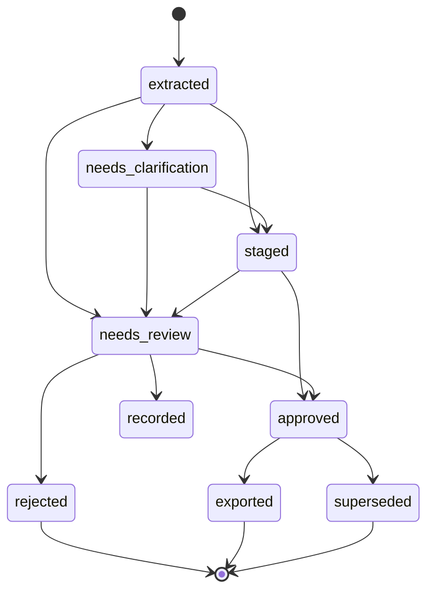

# Data model and invariants

This document is the target model. The local prototype currently stores schedule versions, activities, relationships, reports, events, audit records, and exports in SQLite. Candidate lists, warning lists, and the selected activity are held on each event record; separate proposal and decision tables are planned for shared deployment.

Implemented reliability additions store report `fingerprint`, normalized text/context, ordered corrected `input_rows`, `duplicate_of`, and `duplicate_group_id`; separate `report_similarities` retain review-only comparisons. Events add structured `checks`, routing-policy metadata, and `duplicate_of_event`. `processing_runs` retain content-free operation latency, queue time, failures and model usage. The `duplicate` event status marks consolidated actuals that must not be exported again. Exact repeated reports share canonical events and keep every source receipt. Historical fingerprints/input rows are not invented during migration. See [reliability and calibration](../quality/reliability-and-calibration.md).

## Core records

| Record | Important fields | Purpose |
| --- | --- | --- |
| `schedule_version` | ID, project ID, source checksum, imported at, format, parser version, data date | Immutable baseline for every activity and proposal |
| `activity` | schedule version, external ID, name, WBS path, discipline, location, planned dates, current actuals, status | Normalized schedule node |
| `relationship` | predecessor ID, successor ID, type, lag | Context and warning checks |
| `source_report` | ID, kind, file checksum or message ID, reporter, captured at, timezone, raw location | Immutable evidence container |
| `progress_event` | source ID, source span or row, event kind, described work, stated time, resolved time, discipline, extraction version | One claim extracted from a report |
| `match_candidate` | event ID, activity ID, rank, component scores, evidence | Reproducible matching decision support |
| `update_proposal` | event ID, activity ID, target field, old value, proposed value, warnings, state | Pending schedule change |
| `review_decision` | proposal ID, reviewer, decision, reason, decided at | Human approval or rejection |
| `audit_entry` | actor, action, record ID, before/after digest, time | Append-only history |
| `export_manifest` | schedule version, approved proposal IDs, output checksum, validation result, created at | Proof of what an export contains |

An event and a proposal are different: one report can produce multiple events; one event can have multiple candidate activities but at most one accepted target per processing run.

## Event vocabulary

`actual_start`, `actual_finish`, `in_progress`, `not_started`, `forecast_start`, `forecast_finish`, `partial_progress`, `blocked`, and `unknown`.

The event records what was said. The proposal records what the application suggests changing. For example, `not_started` may contradict an existing actual start, but it does not delete that actual automatically.

## Proposal states

State changes are audited. `staged` means a plausible proposal exists; it does not mean the master schedule changed. An export can reference only `approved` proposals for the same schedule version.

## Invariants

- External activity IDs are unique within one schedule version, not necessarily across projects or versions.
- Original source bytes and the imported schedule version remain unchanged.
- Actual dates are never inferred from planned dates or from an unspecified report date.
- When both actual start and finish are known, finish cannot precede start.
- Timezone and date precision are recorded; an approximate time remains approximate.
- Future-tense events do not populate actual-date fields.
- Conflicts and dependency anomalies are warnings requiring review, not silent overwrites.
- Every exported field value can be traced to an approved proposal and source event.
- A model output is stored with its model and prompt or rule version so a result can be reproduced or challenged.

## Progress history export

The first portable output is a CSV or JSONL dataset with project, schedule version, activity ID, WBS, discipline, event kind, event date, report date, source reference, reviewer decision, and export ID. Raw report text stays in controlled storage; a public sample contains synthetic text only.
