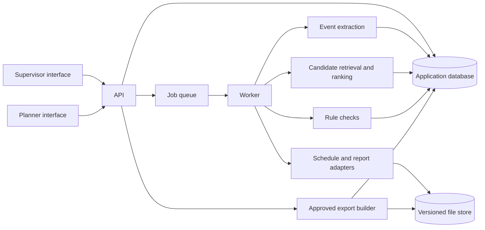
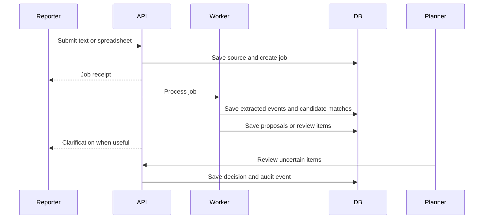

# System architecture

## Shape

The local prototype uses a static web client, a Python standard-library HTTP service, synchronous processing, and SQLite. The rule-based loop runs without installation; optional AI inference uses OpenAI embeddings and structured responses, with a local cross-encoder option. The deployment target below separates heavy processing into a worker and uses a shared relational database. Keep the schedule adapter and matching engine behind interfaces. Add infrastructure when workload measurements justify it.

## Component responsibilities

| Component | Responsibility |
| --- | --- |
| Web client | Text capture, spreadsheet upload, clarification, review queue, activity history, export summary |
| API | Authentication, access checks, request validation, job creation, decisions, transactional state changes |
| Worker | Format parsing, text extraction, matching, duplicate detection, export validation |
| Database | Schedule snapshots, source records, extracted events, candidates, proposals, decisions, audit trail |
| File store | Original uploads, versioned schedule imports, and generated exports with checksums |
| Schedule adapter | Convert supported schedule formats into a common activity graph and generate validated outputs |

## Ingestion flow

## Matching pipeline

1. Normalize activity names, WBS paths, codes, locations, disciplines, and report terminology without discarding original strings.
2. Generate candidates using exact identifiers, lexical search, and semantic retrieval where available. A missing semantic service must not prevent a safe review path.
3. In AI mode, rerank candidates with a structured model response or an optional local cross-encoder. Compare these with the rule baseline before making accuracy claims.
4. Use relationship state, planned dates, and location as ranking features and warnings. Do not silently prune every out-of-sequence activity.
5. Route clear candidates to a staged proposal, close candidates to clarification, and uncertain or contradictory candidates to planner review. Thresholds come from held-out evaluation data.

## Data and job boundaries

- The current local API processes a report synchronously, then stores the source and proposals in one transaction. The deployment target first stores the source and a processing receipt so retries can be idempotent.
- Each extracted event and proposal has a stable ID. Reprocessing creates a new processing run, not a silent replacement.
- Worker jobs can retry safely using a source ID and processing version.
- Decisions and export manifests are committed transactionally. A failed export does not mark proposals exported.
- Long-running parsing and model work runs in a separate worker process; the API returns a job receipt and exposes status.

## Current and later technology direction

- **Current:** plain JavaScript web client, Python standard-library API, synchronous rule and optional AI engines, and SQLite. The app binds to localhost and provides password accounts, cookie sessions, and project-scoped roles. Shared deployment still needs HTTPS hosting and operational hardening. See [access and recovery](access-output-recovery.md). See [grounded AI matching](ai-rag.md).
- **Later:** a typed API, separate job worker, PostgreSQL, durable queue, and versioned file storage. Calibrate semantic retrieval and reranking on a reviewed matching benchmark.
- Heavy parsing or inference should not rely on in-process API background tasks in a shared deployment.

The local build now includes scan and voice adapters, retained source captures, a browser service worker and IndexedDB outbox, an Ollama inference profile, and a read-only schedule scenario engine. See [capture, offline operation, and analytics](capture-offline-analytics.md) for implementation boundaries and deployment.

See [data model](data-model.md), [API outline](api.md), and [schedule integration](schedule-integration.md) for the contracts behind these boundaries.
